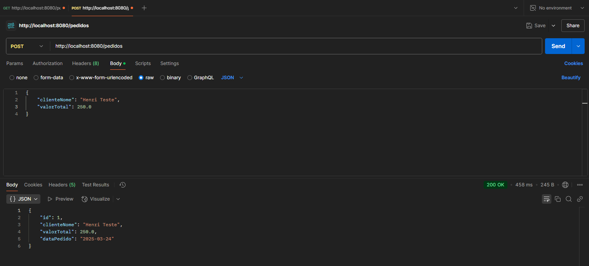
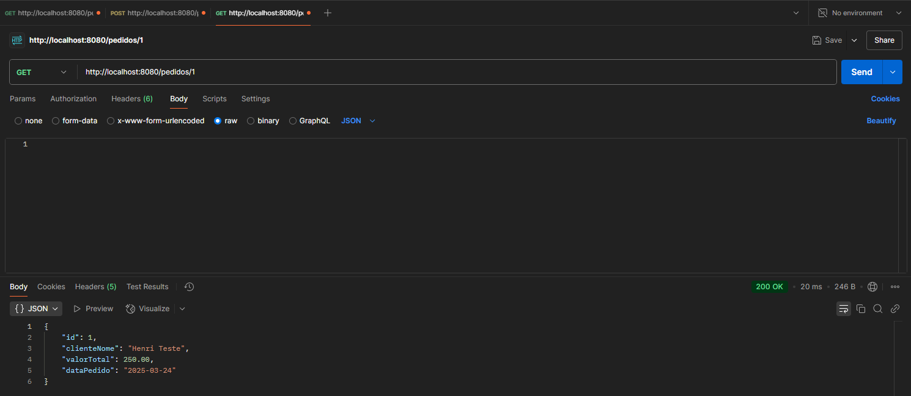
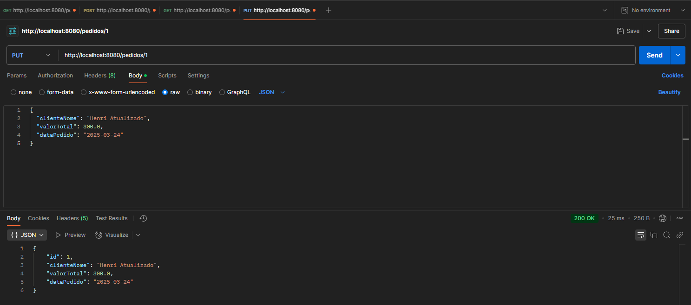

# 🧾 Checkpoint 1 - API de Pedidos (FIAP - SOA e Web Services)

Este projeto é uma API REST desenvolvida com Spring Boot para cadastro e gerenciamento de pedidos de clientes. Foi realizado como parte do Checkpoint 1 da disciplina de Arquitetura SOA e Web Services da FIAP.

---

## 🚀 Como executar o projeto

### ✅ Pré-requisitos
- Java 17 ou superior
- Maven

### ▶️ Passo a passo

1. **Clone o repositório:**
```bash
git clone https://github.com/seu-usuario/fiap-soa-checkpoint1.git
cd fiap-soa-checkpoint1
```

2. **Execute o projeto:**
```bash
mvn spring-boot:run
```

3. **Acesse a aplicação:**
```
http://localhost:8080
```

---

## 🌐 Endpoints da API

| Método | Endpoint         | Descrição                       |
|--------|------------------|---------------------------------|
| GET    | /pedidos         | Lista todos os pedidos          |
| GET    | /pedidos/{id}    | Busca um pedido pelo ID         |
| POST   | /pedidos         | Cria um novo pedido             |
| PUT    | /pedidos/{id}    | Atualiza um pedido existente    |
| DELETE | /pedidos/{id}    | Remove um pedido pelo ID        |

---

## 📦 Exemplo de Requisições (JSON / cURL / Postman)

### 🔸 Criar pedido (POST)
```http
POST http://localhost:8080/pedidos
Content-Type: application/json

{
  "clienteNome": "Ana Souza",
  "valorTotal": 299.90
}
```

---

### 🔸 Buscar todos os pedidos (GET)
```bash
curl -X GET http://localhost:8080/pedidos
```

---

### 🔸 Buscar por ID (GET)
```bash
curl -X GET http://localhost:8080/pedidos/1
```

---

### 🔸 Atualizar pedido (PUT)
```http
PUT http://localhost:8080/pedidos/1
Content-Type: application/json

{
  "clienteNome": "Ana Souza",
  "valorTotal": 350.00,
  "dataPedido": "2025-03-24"
}
```

---

### 🔸 Deletar pedido (DELETE)
```bash
curl -X DELETE http://localhost:8080/pedidos/1
```

---

## 🗄️ Acessar o banco de dados H2

1. Inicie a aplicação (`mvn spring-boot:run`)
2. Acesse no navegador:
```
http://localhost:8080/h2-console
```

### Configuração:
- **JDBC URL:** `jdbc:h2:mem:testdb`
- **Usuário:** `sa`
- **Senha:** *(deixe em branco)*

---

## 🧪 Testes realizados

### 🔸 Criar Pedido (POST)


### 🔸 Listar Pedidos (GET)


### 🔸 Buscar por ID (GET)


### 🔸 Atualizar Pedido (PUT)


### 🔸 Deletar Pedido (DELETE)


---

## 🎓 Sobre

Este projeto foi desenvolvido como parte da disciplina de **Arquitetura SOA e Web Services** na FIAP.  
Tem como objetivo aplicar os conceitos de API REST, Spring Boot e integração com banco de dados H2 em memória.

---

📬 Dúvidas ou sugestões? Fique à vontade para contribuir ou entrar em contato!
